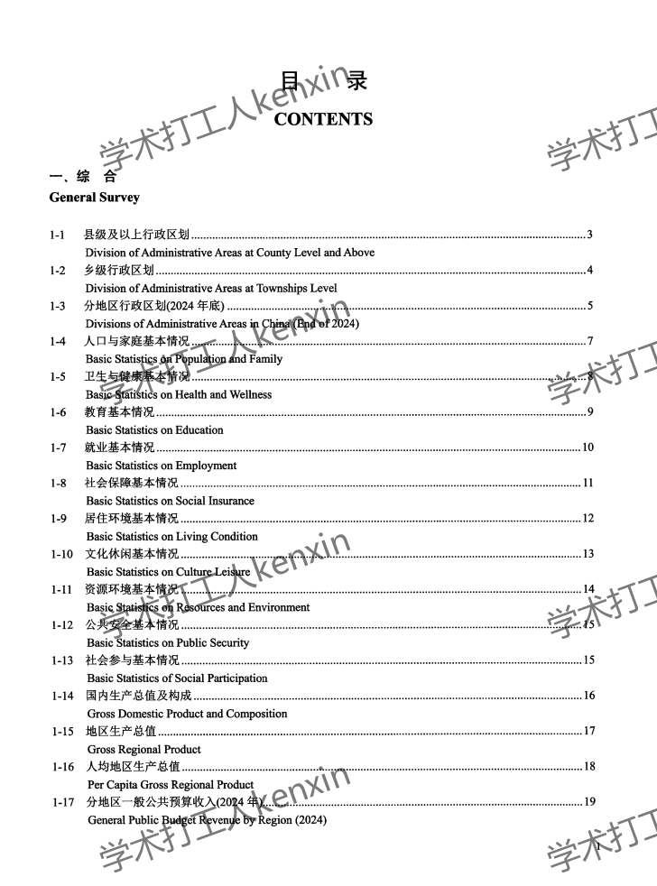
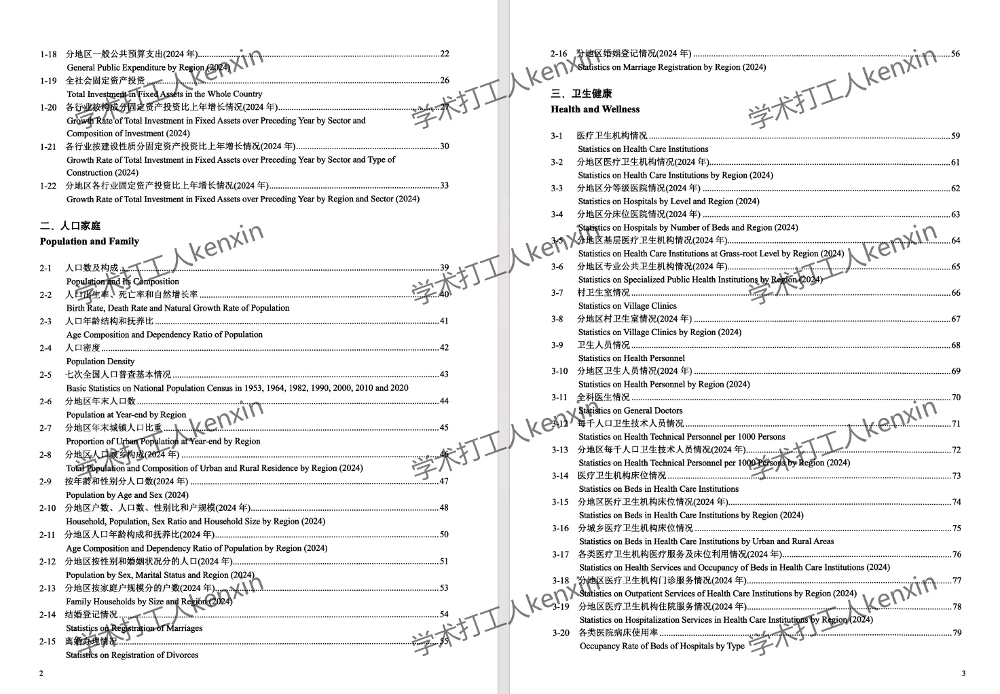
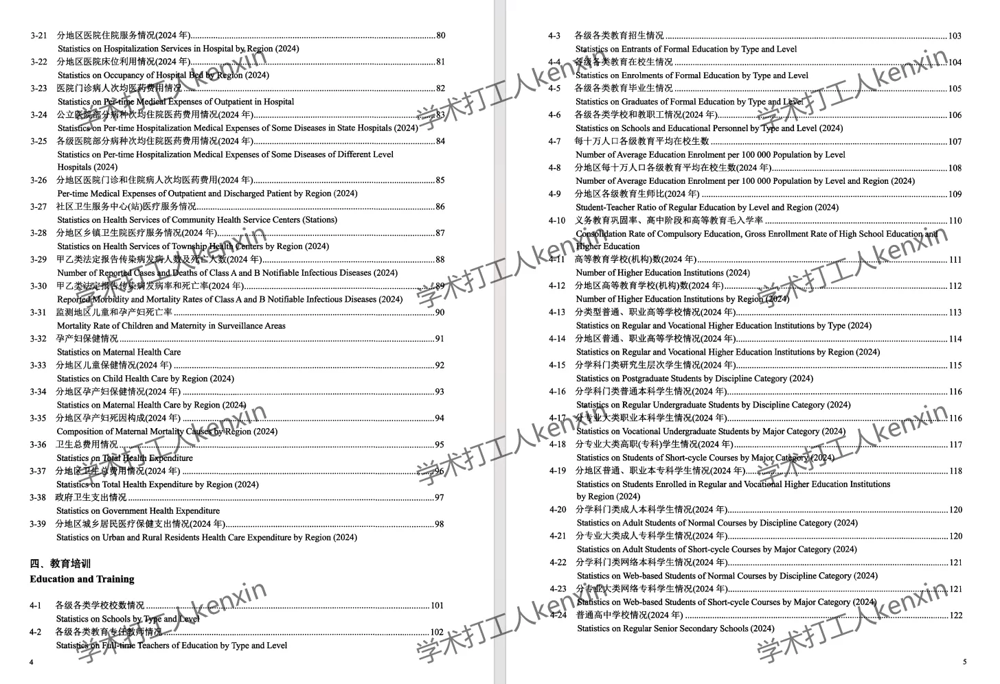
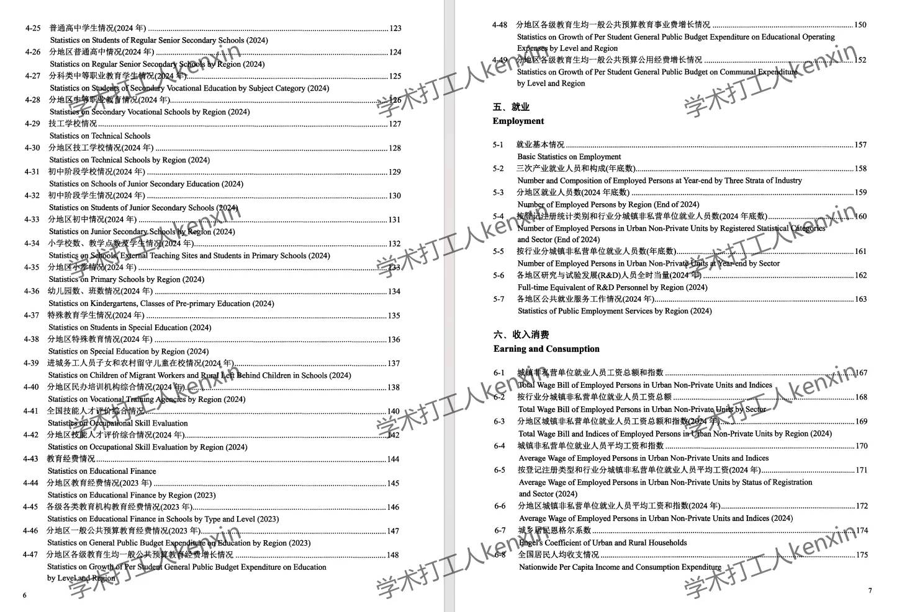
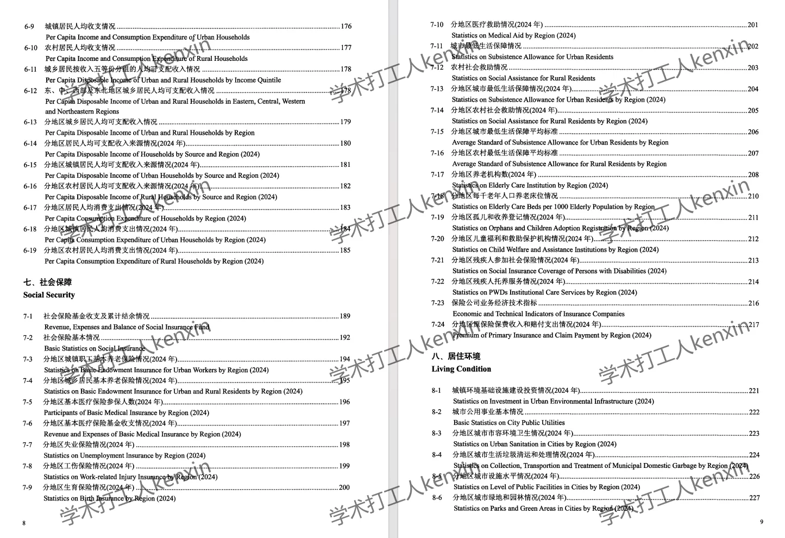
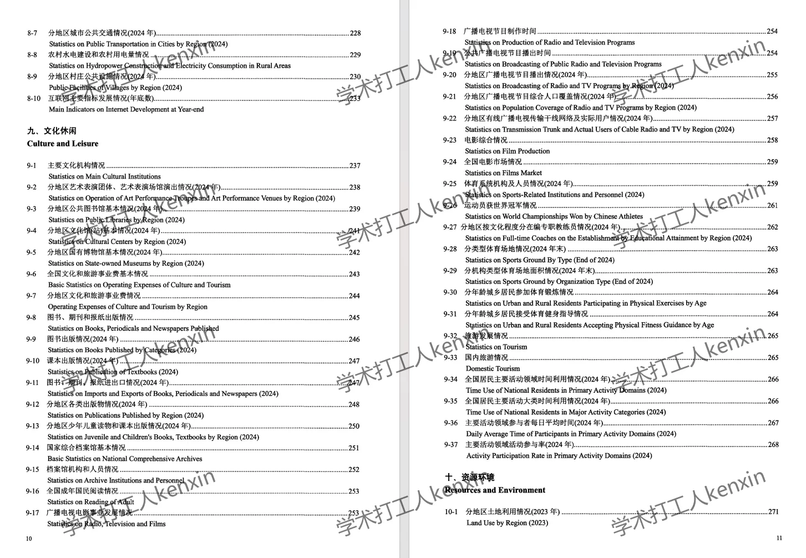
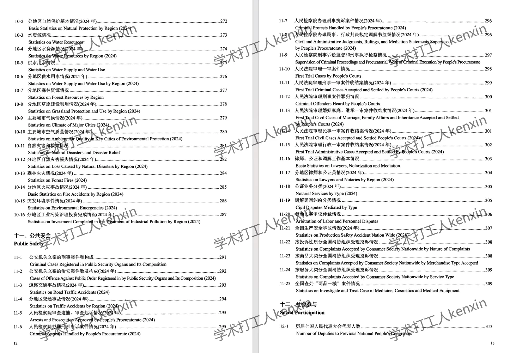
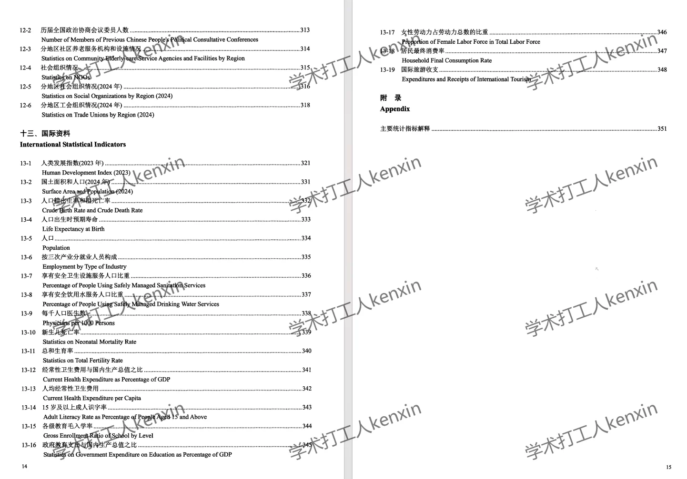

## Body

《China Social Statistical Yearbook》（2006-2025）

Data Year: The yearbook covers data from 2006 to 2025 (the data is based on the previous year).
All entries are raw yearbooks, not panel data compiled neatly! Please be clear before purchasing and understand that there will be no returns or exchanges after purchase.

01. Data Introduction
"China Education Statistical Yearbook"

02. Indicator Details
The directory is displayed in the picture for reference. Due to the limited space of the picture, it cannot display all information. The actual content of the yearbook should be referred to. Please view it independently and make your purchase accordingly. If you need help finding data, please let me know, as all the indicators are here. After shipment, we do not support return without reason.
The display directory is for 2025, for reference only. Different statistical methods may change over time. For academic knowledge, please note.

03. Data Format
Format: Excel and PDF, placed within a zip file.

## Images

Here is a pay link on Stripe ( https://buy.stripe.com/3cs8yP7sY87d0vu9AB ). Please contact me lonlonago@foxmail.com after funding $89, and I will send you a complete data files , thank you!

